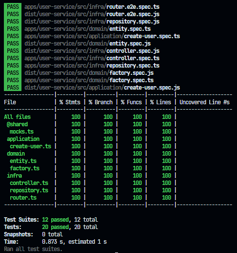
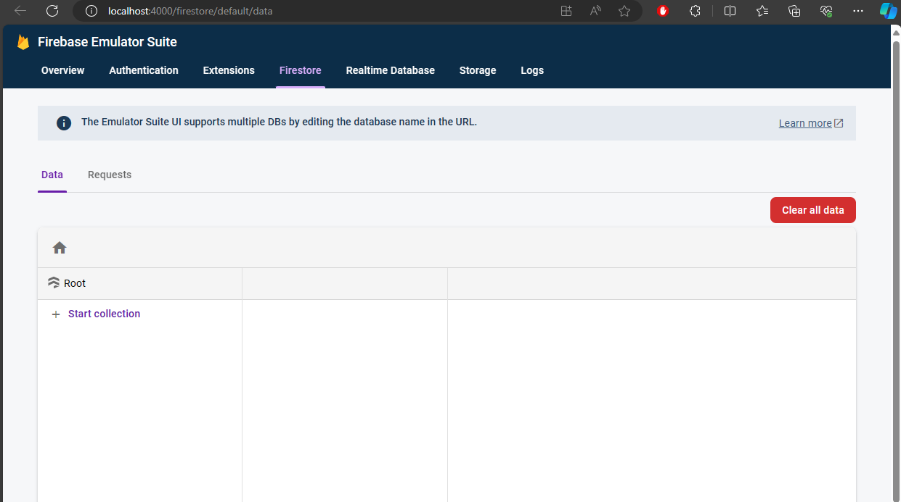
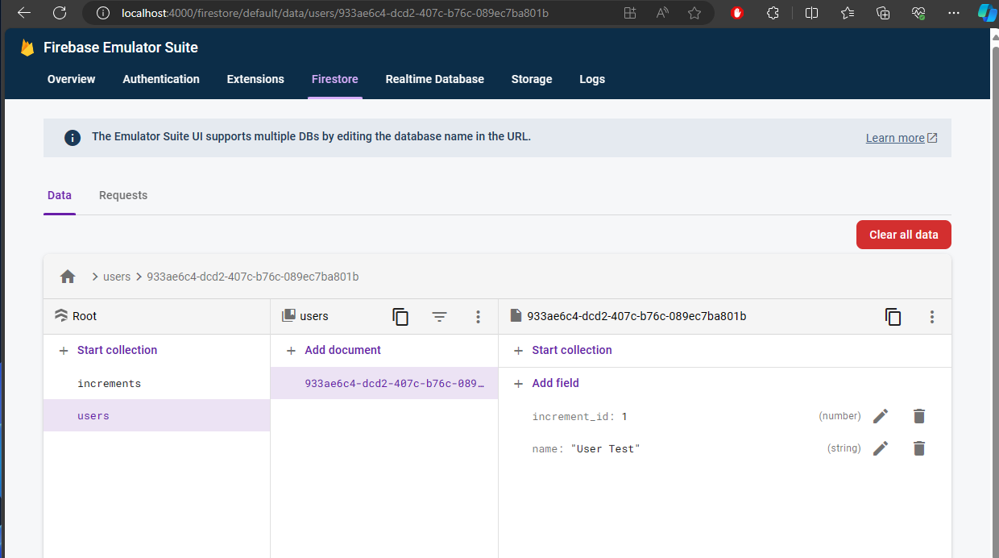
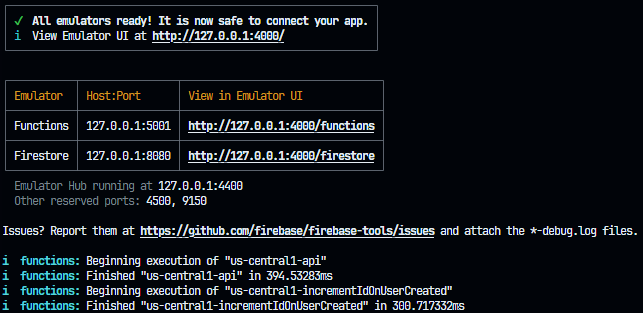

# Desafio

Como planejar um aplicativo que tende a escalar? Qual arquitetura utilizar para escalar o projeto para centenas de funções serverless?

Escrever software modular com arquitetura limpa, princípios SOLID e serviços distribuídos é essencial para criar sistemas escaláveis, flexíveis e fáceis de manter. Ao adotar essa abordagem, os componentes do sistema são isolados e interagem por interfaces definidas, facilitando substituições e atualizações sem impactar o sistema. A arquitetura limpa, aliada aos princípios SOLID, promove código organizado e flexível, enquanto os serviços distribuídos aumentam a resiliência e escalabilidade. A separação de equipes para atuar em serviços específicos, testes automatizados e padronização de código garantem a qualidade e colaboração, resultando em software seguro e de alta qualidade.

**Tecnologias utilizadas:**

- Firebase
  - Cloud Functions
  - Cloud Firestore
  - Emulators
- Node.js / TypeScript / JavaScript
- Jest / Supertest / SWC
- Git / GitHub

**Conceitos utilizados:**

- Monorepo
- Arquitetura de microsserviços
- Arquitetura serverless
- Arquitetura baseada em eventos
- Arquitetura limpa
- SOLID / KYSS / YAGNI / DRY
- Testes unitários / e2e
- API Rest

**Abordagem aplicada ao desafio:**

Para solucionar o desafio utilizei microsserviços + monorepo. Cada pasta dentro do diretório `apps` é um microsserviço. A ideia é utilizar boas práticas e conceitos de desenvolvimento de software, como princípios SOLID, arquitetura limpa e testes automatizados.

### Executando o projeto

Para executar o projeto é necessário as seguintes ferramentas instaladas na máquina:

- Git
- Docker, Docker Compose
- Node.js, npm
- Firebase CLI
- Java

**Passo a passo:**

- Clonar o projeto

```
git clone https://github.com/dalloglio/firebase-monorepo.git
```

- Instalar as dependências

```
npm i
```

- Executar os testes (unitários + e2e)

```
npm test
```

- Executar os testes + cobertura de testes

```
npm run test:cov
```



- Executar o projeto via Firebase Emulator

```
npm start
```

- Abrir no navegador o Cloud Firestore via Emulator UI http://localhost:4000/firestore



- Criar um usuário

```
curl --location 'http://127.0.0.1:5001/challenge-open-circle/us-central1/api/users' \
--header 'Content-Type: application/json' \
--data '{
    "name": "User Test"
}'
```

- Usuário cadastrado com o `name` e o `increment_id`



- Log da criação do usuário via `curl` e execução do trigger para inserir o `increment_id`



_Para maiores informações ou qualquer dúvida entre em contato pelo e-mail ricardo.tech@live.com_
